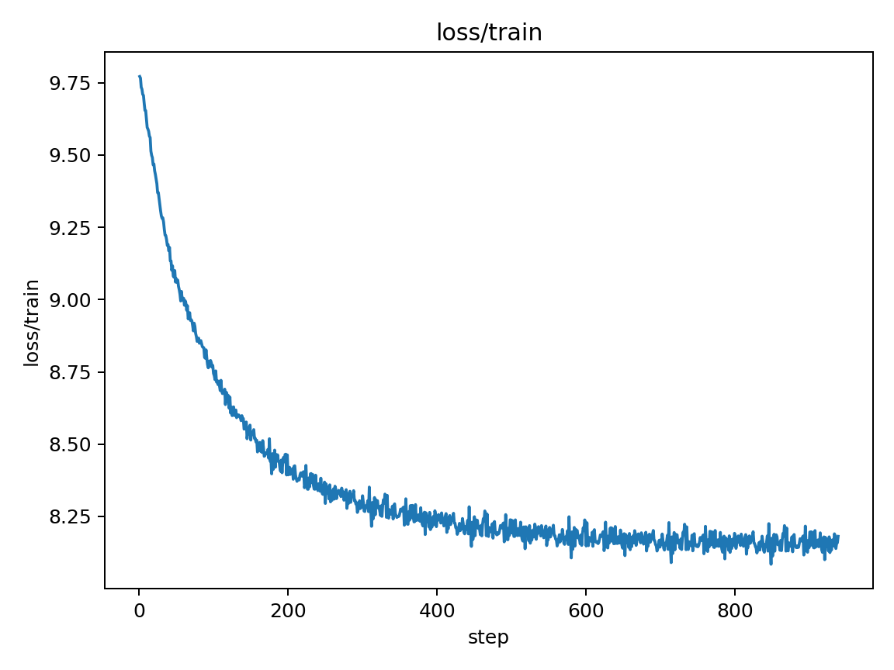
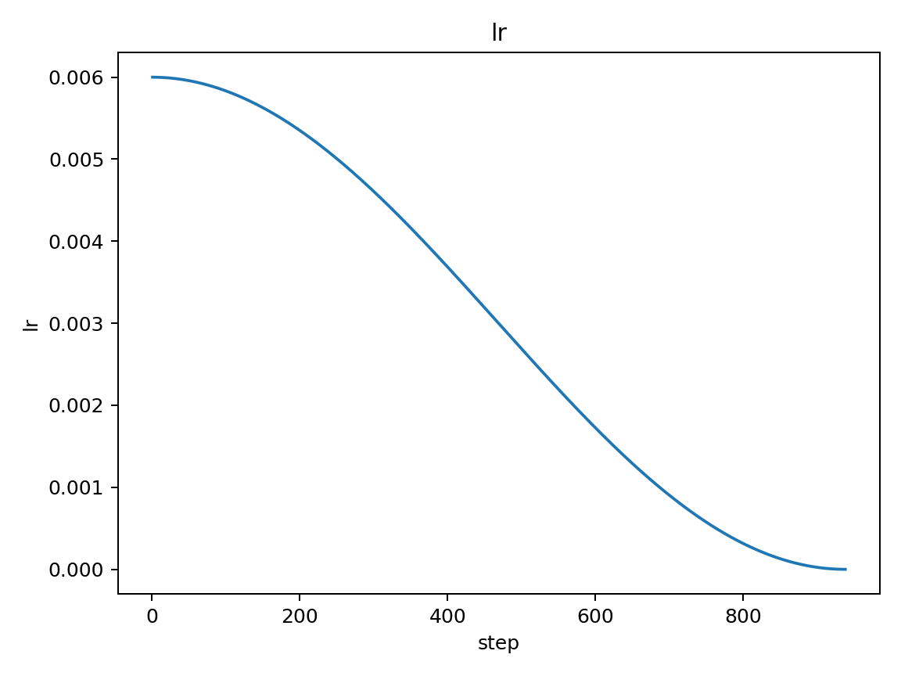
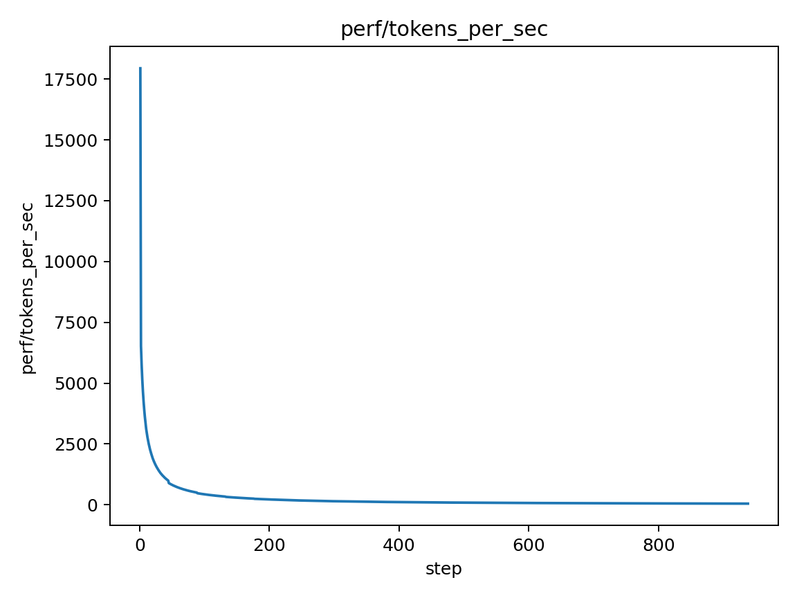
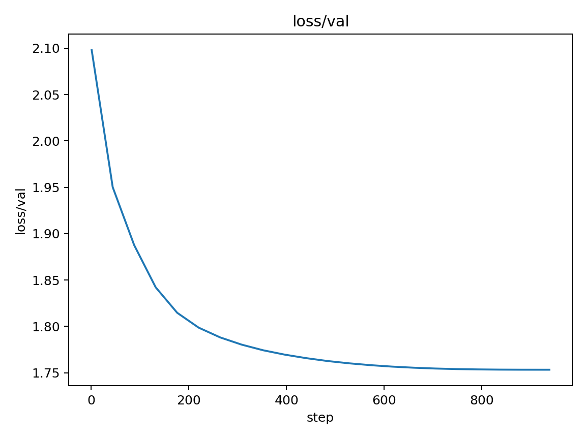
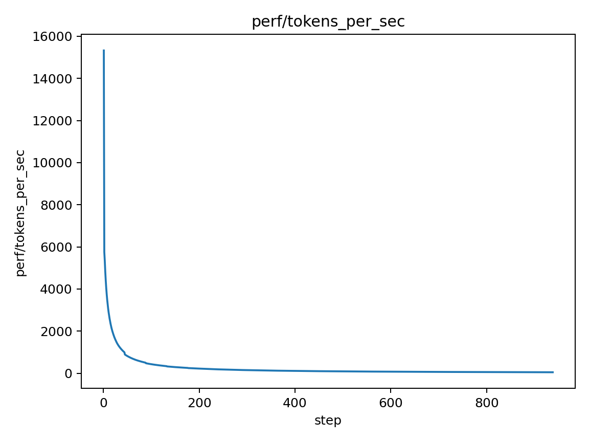
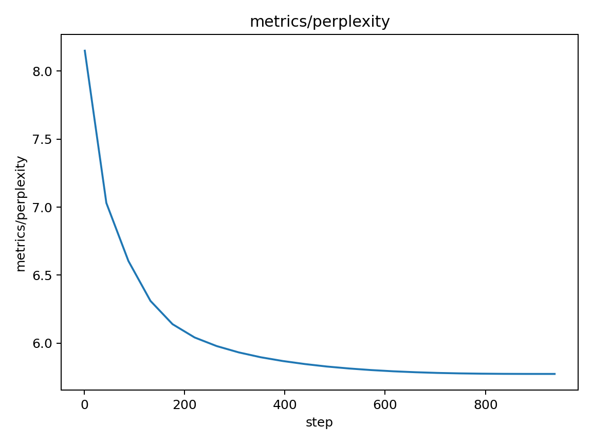

MainRun Report

Baseline

- Best validation loss (7 epochs): 1.7533
- Source run: mainrun/runs/latest
- Figures (latest snapshot):

Notes

- Curves show steady training loss decrease with periodic validation spikes aligned with evals.
- Validation loss converges near 1.75 by epoch 7, meeting the baseline target.
- LR cosine schedule decays smoothly; throughput is stable.

## baseline_20251002 — Baseline run (7 epochs)
- Change: Initial logging + report pipeline
- Rationale: Establish reference metrics and artifacts
- Settings: `optimizer=SGD, lr=6e-3, batch=64`
- Best val loss: **1.7533**

Figures:

